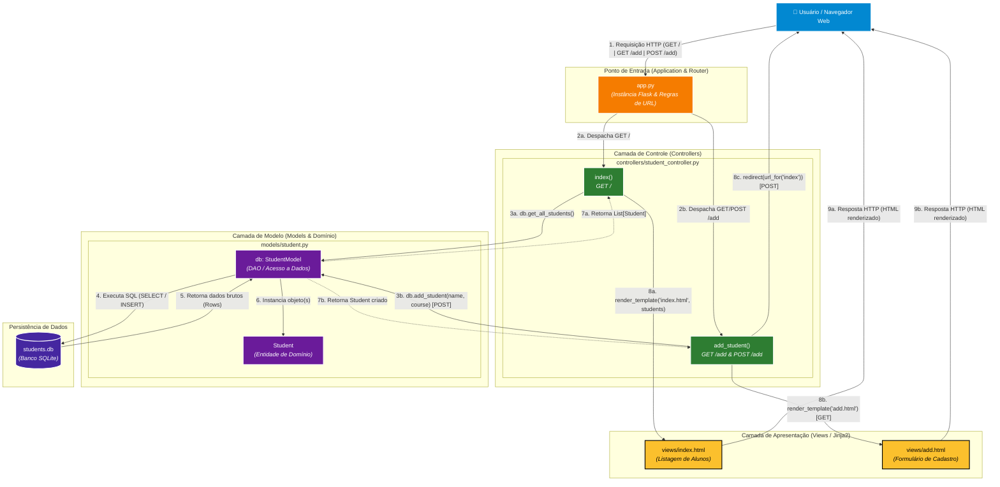
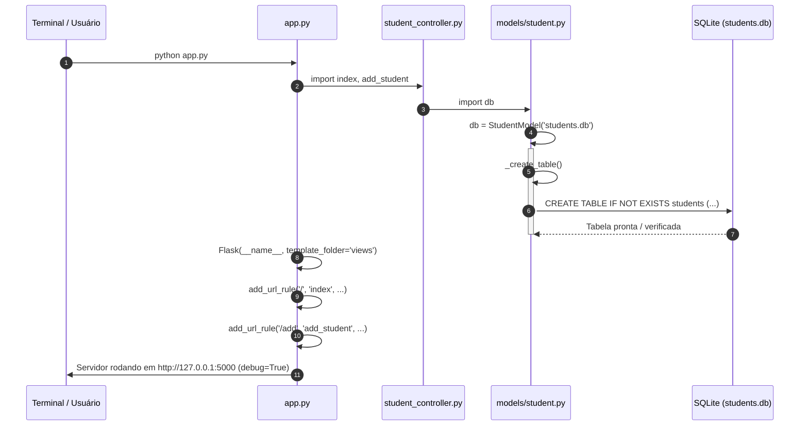
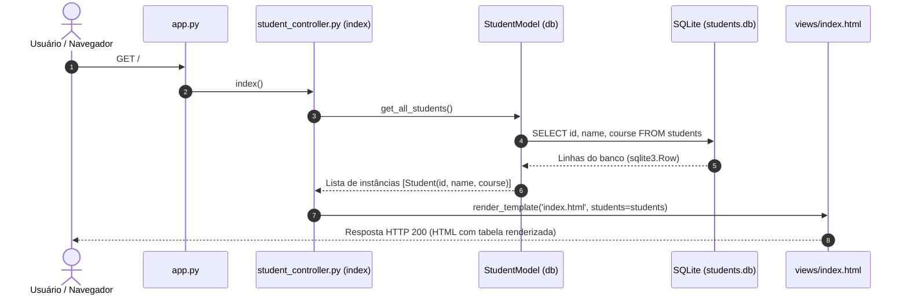
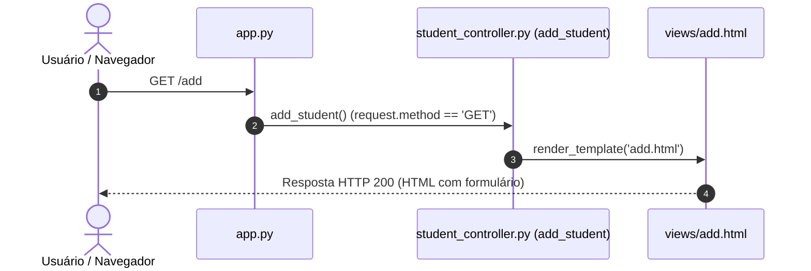
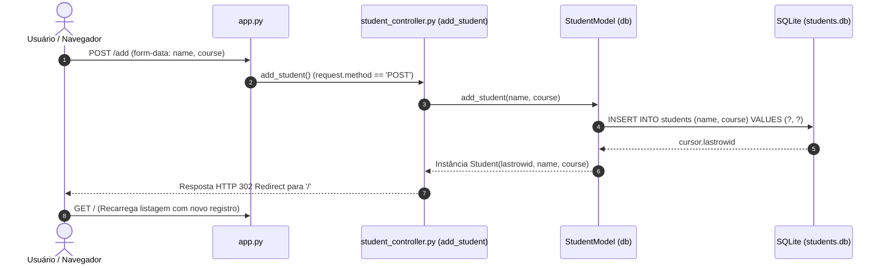
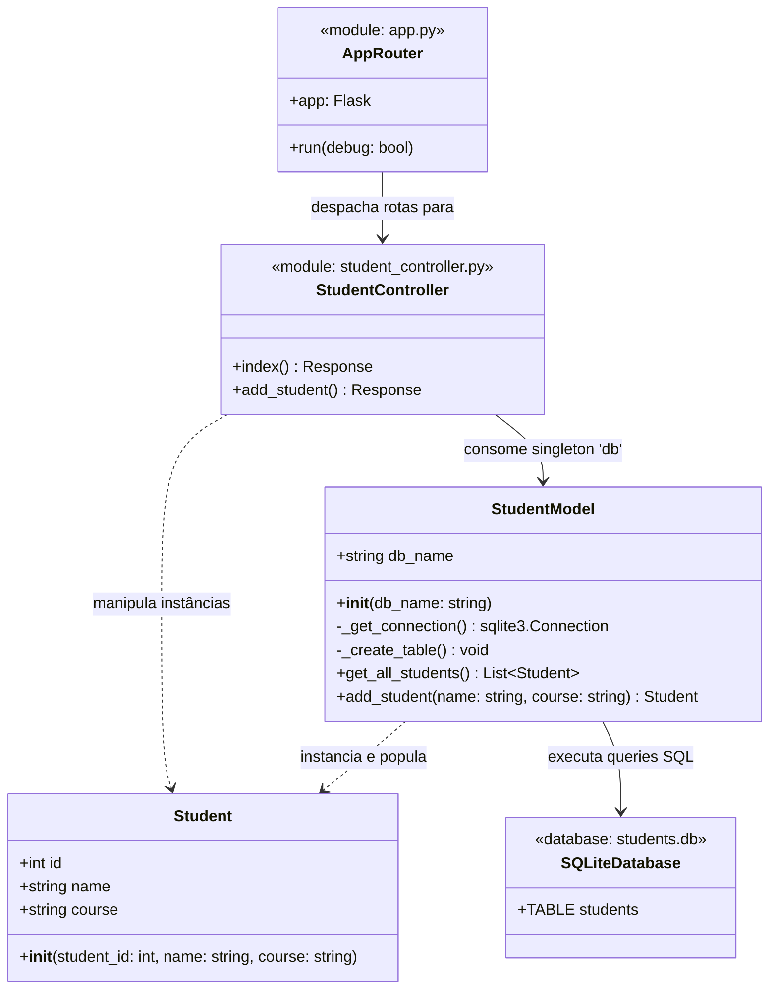
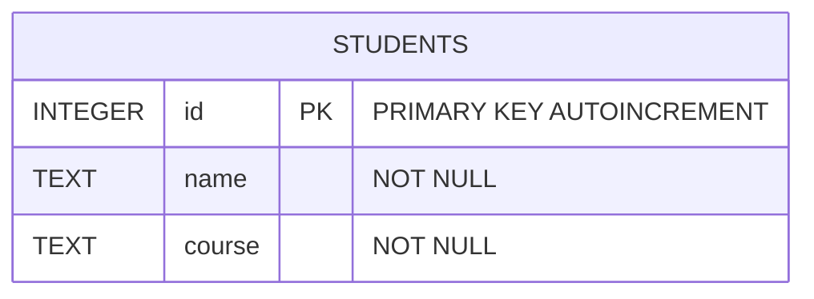

# Especificação e Diagrama Arquitetural - Aplicação MVC (Cadastro de Alunos)

Este documento apresenta a especificação arquitetural completa da aplicação de Cadastro de Alunos, desenvolvida sob o padrão arquitetural **MVC (Model-View-Controller)** com **Flask** e **SQLite**.

---

## 1. Visão Geral da Arquitetura (MVC)

---

## 2. Diagramas de Sequência (Fluxos da Aplicação)

### 2.1. Fluxo de Inicialização (Bootstrap / Startup)

Demonstra como o servidor carrega os módulos, cria as tabelas no SQLite se não existirem e disponibiliza as rotas.

---

### 2.2. Fluxo de Listagem de Alunos (`GET /`)

---

### 2.3. Fluxo de Acesso ao Formulário de Cadastro (`GET /add`)

---

### 2.4. Fluxo de Cadastro de Novo Aluno (`POST /add`) — Padrão Post/Redirect/Get (PRG)

---

## 3. Diagrama de Classes e Módulos

---

## 4. Diagrama do Modelo de Dados (Entidade-Relacionamento)

